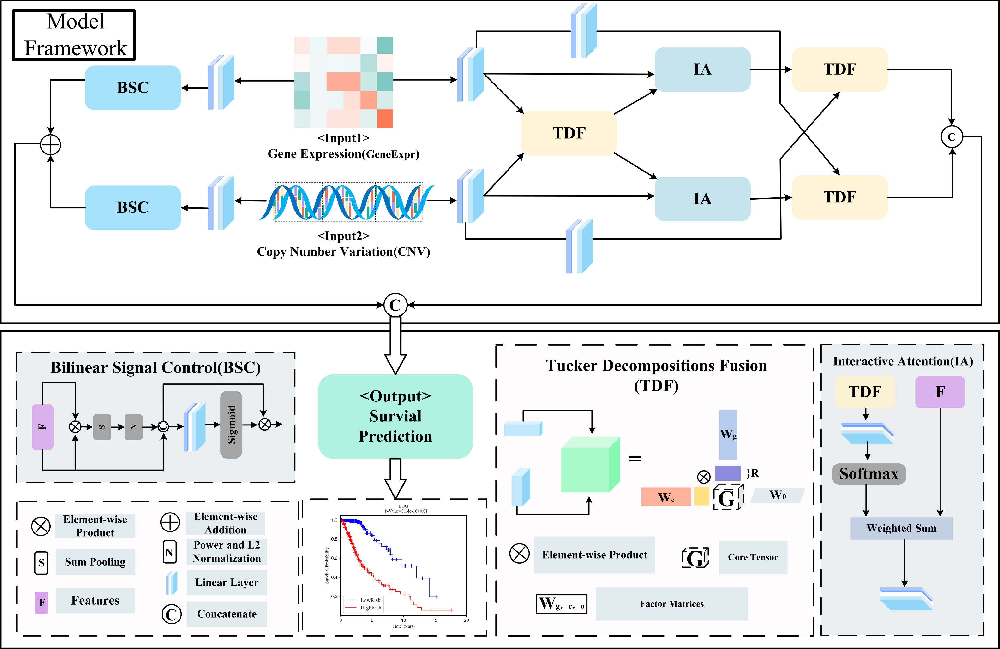

# Title: TDMFS:Tucker Decomposition Multimodal Fusion Model for Pan-Cancer Survival Prediction

Integrated analysis of multimodal data provides a more comprehensive view for cancer survival prediction. However, due to the heterogeneity of different modal data, the integration and mining of different modal information suffers from high computational cost, overfitting and difficulty in obtaining a complete fusion representation. To address the above issues, we propose the first Tucker decomposition multimodal fusion model for pan-cancer survival prediction(TDMFS). The focus of the model is to capture deep fusion representations between different modalities by limiting the complex tensor parameters generated during fusion using Tucker decomposition, thus significantly reducing computational cost and the risk of overfitting. The individual modality-specific representations are then fully exploited by signal modulation mechanisms in a bilinear pooling decomposition to serve as complementary information for the deep fusion representation. In this paper, the performance of TDMFS is evaluated using a 5-fold cross-validation method with two modal data, gene expression (GeneExpr) and copy number variation (CNV), for 33 cancers from The Cancer Genome Atlas (TCGA) database. The experimental results show that the average C-index of the proposed TDMFS is 0.757 on 33 cancer datasets, and the C-index is higher than 0.80 on 10 cancer datasets. Survival curves for both high and low risk patients plotted on 27 cancer datasets were statistically significant. The performance of TDMFS compares favourably with other survival models and fusion approaches such as LinearSum and Multimodal Factorisation Higher Order Pooling. It is valuable for future clinical research in cancer.
Keywords: pan-cancer, tucker decomposition, multimodal fusion, survival prediction

## How to use
Use `train_mian.py` to train the model.

# Acknowledgement 
Thanks to the following people for their work.
* Chen, R.J., et al., Pan-cancer integrative histology-genomic analysis via multimodal deep learning. Cancer Cell, 2022. 40(8): p. 865-+.
* Ben-younes, H., et al., MUTAN: Multimodal Tucker Fusion for Visual Question Answering. Arxiv, 2017.

